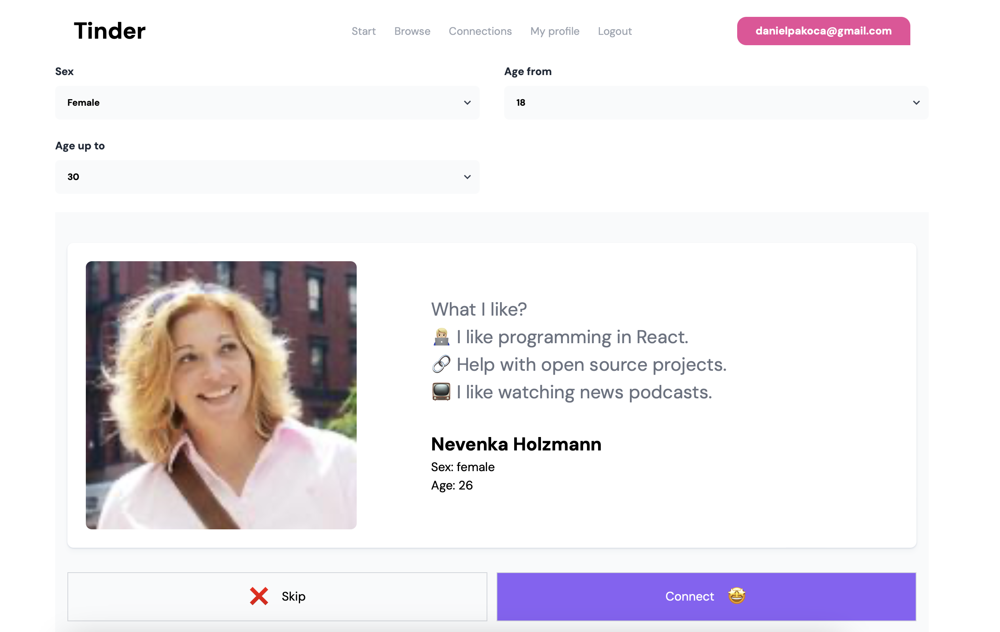
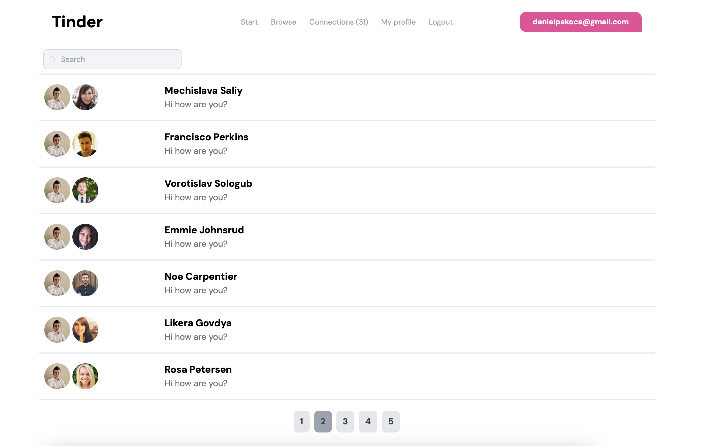
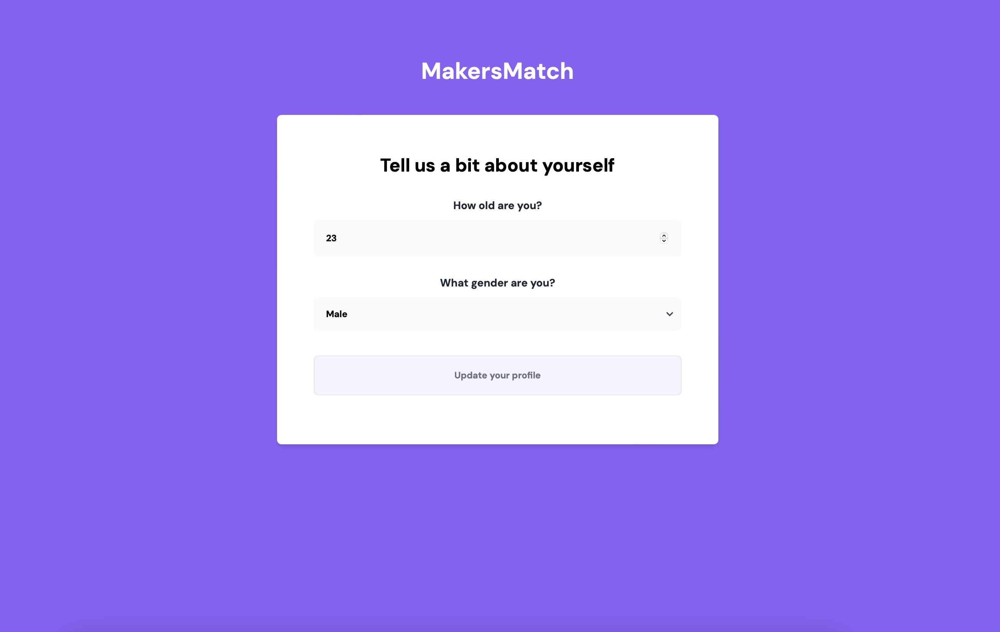

# Tinder APP

## General info

The project created using the latest libraries to learn Next.js well. PostgreSQL database built in
Docker.

## Technologies

- ReactJS 18.2
- Next.js 13.4 (+ SWR)
- NextAuth.js 4.22
- Prisma 5.0
- Axios 1.4
- Tailwind CSS 3.3
- PostgreSQL 15.0

## Website

[Tinder APP - website](https://tinder-nextjs-alpha.vercel.app/)

## Features

- Add a new account using github.
- Change the user's age and gender.
- Search engine for people by gender and age.
- If 2 people like each other, then they can write to each other.
- Write messages to each other.
- Message search (filtering records)
- Pagination
- Environment created in Docker
- Deploy on Vercel

## Illustrations

   &nbsp;
  
    
   &nbsp;
  

